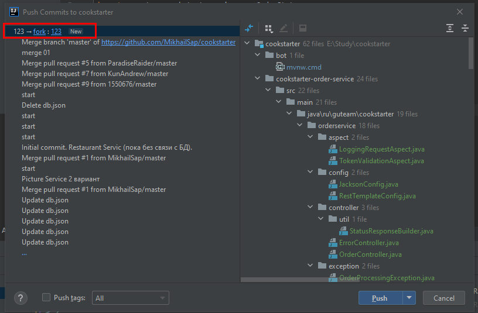

**Как мы работаем с git.**

*Инструкция для Idea, но скорее всего в сторонних программах все устроено аналогично.
Также стоит отметить, что форк создан не совсем для таких ситуаций, 
и в реальной работе вполне вероятно вы даже не столкнетесь с работой с двумя репозиториями*

* Подкючаем два репозитория - свой форк и основной

Если их не два, то добавляем плюсом (имя можно дать любое, у меня например мой репозиторий это fork)

* В списке должно быть два remote репозитория. Если нет, то делаем fetch

* Далее сначала делаем checkout мастер-ветки. И после этого создаем новую ветку из мастера 
(New branch from selected). В ней будут все изменения.

Если нужно не создать новую ветку, а подтянуть изменения в существующую, 
то, во-первых, необходимо, чтобы ваша ветка была активной
(см. на картинке ветку orderservice), и выбираем из меню Merge into current. 
Тут могут появиться конфликты, нужно грамотно их решить.

* Таким образом я создал ветку, которая называется 123 (не называйте так ветки :) ). 
В нее можно делать коммиты.

* И наконец делаем push. Т.к. сделать push в основной репозиторий мы не можем, 
то обязательно нужно проверить, чтобы вверху был fork (ну или как вы назвали свой репозиторий). 
Изменить можно нажав на это название.

* Все. Заходим на гитхаб и создаем пулл реквест.